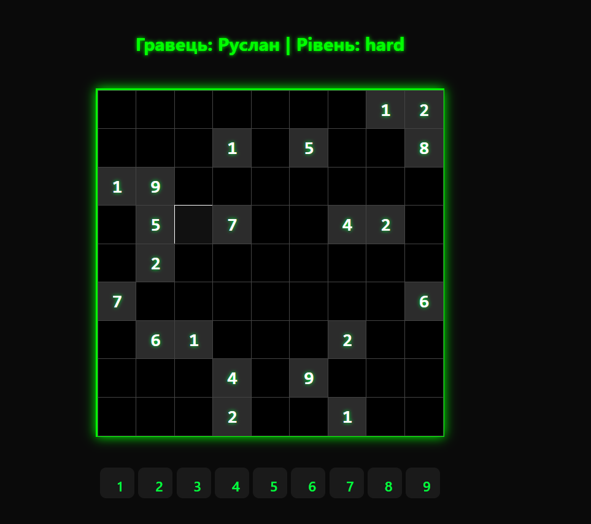

# 🧩 Sudoku Game (React + Zustand)

Сучасна, інтерактивна гра Судоку, розроблена в рамках курсу "Front-end розробка". Проєкт демонструє еволюцію від статичних компонентів до повноцінного SPA (Single Page Application) з глобальним стейт-менеджментом.


*(Інтерфейс гри)*

## 📚 Звіт по Лабораторних Роботах (Implementation Report)

У цьому проєкті реалізовано вимоги 5 лабораторних робіт:

### ✅ ЛР 1: Компоненти та Props
**Завдання:** Створити базову структуру React-додатка, розбити інтерфейс на компоненти.
- **Реалізація:**

    - Реалізовано передачу даних через `props` (значення клітинки, статус, стилі).
    - Використано CSS Modules для ізоляції стилів компонентів.

### ✅ ЛР 2: Хуки та Життєвий цикл (Hooks)
**Завдання:** Реалізувати логіку взаємодії користувача з інтерфейсом.
- **Реалізація:**
    - Розроблено кастомний хуки.
    - Використано `useEffect` для відстеження натискань клавіатури (Global Event Listeners).
    - Реалізовано `useState` для збереження стану сітки та виділеної клітинки.

### ✅ ЛР 3: Робота з формами (Forms & Validation)
**Завдання:** Створити сторінку налаштувань з валідацією вводу.
- **Реалізація:**
    - Створено `StartPage` для введення імені гравця та вибору складності.
    - Використано бібліотеку **React Hook Form** для обробки форми.
    - Підключено **Yup** для валідації (перевірка довжини імені, обов'язкових полів).

### ✅ ЛР 4: Маршрутизація (React Router v6)
**Завдання:** Організувати навігацію між сторінками SPA.
- **Реалізація:**
    - Налаштовано `createBrowserRouter` у файлі `router.jsx`.
    - **Динамічний роутинг:** Параметри гри передаються через URL (`/game/:difficulty/:playerName`).
    - Використання хуків `useNavigate` для переходів та `useParams` для читання параметрів URL.
    - Реалізовано Layout через компонент `<Outlet />`.

### ✅ ЛР 5: State Management (Zustand)
**Завдання:** Організувати глобальне керування станом (Store).
- **Реалізація:**
    - Підключено бібліотеку **Zustand** для модульного керування станом.
    - **Модульність:** Створено окремі стори `useSettingsStore` (налаштування) та `useResultsStore` (рекорди).
    - **Persist:** Реалізовано збереження даних у `localStorage` (стан не зникає при перезавантаженні).

---

## 🚀 Функціонал гри (Features)

- **Геймплей:** Генерація унікальних судоку (алгоритм з backtracking), перевірка перемоги.
- **Керування:** Підтримка мишки та клавіатури (Numpad / цифри / Backspace).
- **UX:**
    - **Dark Mode:** Стильний "кіберпанк" дизайн, що не втомлює очі.
    - **Smart Validation:** Підсвічування помилок у реальному часі.
    - **Modal:** Модальні вікна через React Portals.
- **Історія:** Таблиця рекордів із збереженням дати та рівня складності.

## 🛠 Технологічний стек

- **Core:** React 18, Vite
- **Router:** React Router DOM v6
- **State:** Zustand (+Middleware)
- **Forms:** React Hook Form + Yup
- **Styling:** CSS Modules, Modern CSS3

## 📂 Структура проєкту

```bash
src/
├── components/      # Game (Board, Cell), UI (Button, Modal)
├── hooks/           # Логіка (useSudokuBoard, useSelection, useGameSetting)
├── pages/           # Сторінки (Start, Game, Results)
├── store/           # Zustand Stores (Global State)
├── utils/           # Алгоритми генерації та валідації
├── router.jsx       # Конфігурація маршрутів
└── main.jsx         # Entry Point (Providers)
```
## 🚀 Запуск проєкту
1. Встановлення залежностей:
   ```npm install```
2. Запуск локального сервера:
   ```npm run dev```
### Developed by ІПЗ-23-4 Цимбалюк Руслан